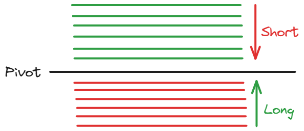
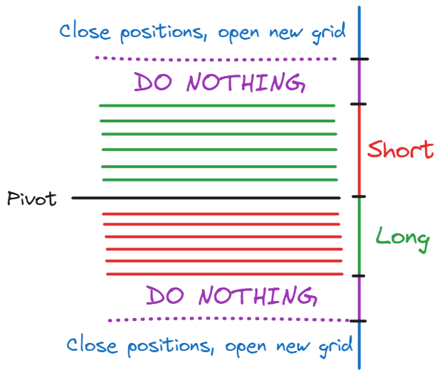
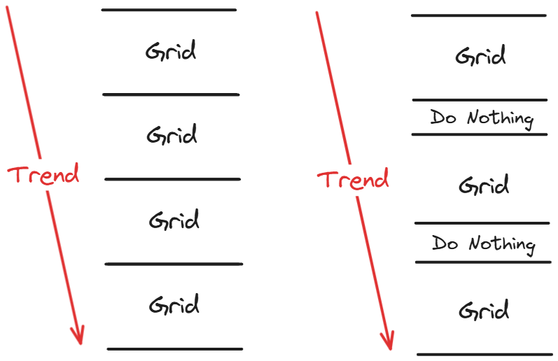
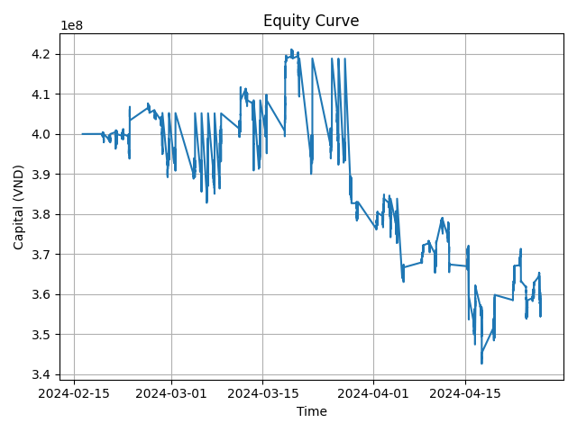

# Group 5 - Dynamic Grid Strategy
  
## Abstract

The project provides an implementation of the grid strategy that aims to remove the need to identify market trends, and instead relies on utilizing price fluctuations to make trading decisions. We designed our solution specifically for Vietnam's derivative markets where the settlement date T+0, allowing traders to open and close multiple positions in a day. The resulting product can generate a 4.12% holding period return when applied to VN30F1M contract data in 2023.

  

## Introduction

It is often hard for novice traders to correctly identify the market is experiencing a bullish or bearish trend, and take corresponding actions. Mis-identifying trends can lead to decisions that have a negative impact on your net asset value of your portfolio. Grid strategy emerges as a distinctive strategy within the trading realm. It removes the need to recognize momentum patterns, but instead utilizes price fluctuations in the market.

  

Our approach dynamically set a trading range that is a predefined number of intervals (called "levels") above and below the current price, or also called the "pivot" point. Prices below the pivot signifying a long position, and prices above the pitot signifying a short position. The expectation is prices will revert back to a grid level, regardless of the type of positions that are opened.

  

We trained the parameter set of our strategy on the VN30F1M futures index, a derivative instrument linked to the Vietnamese VN30 equity index. The chosen period is within mid-February 2024 and April 2024, because it contains both sideways and trending market movements which may help the trained algorithm to perform better on out-of-sample data or in real trading. After the parameter set has been learned, we apply our algorithm on 2023 market data and generate a 4.12% holding period return during the period.


## Related Work

Readers are recommended to read the below resources to have a better understanding of grid trading:

- Algotrade: https://hub.algotrade.vn/knowledge-hub/grid-strategy/

- FXOpen: https://fxopen.com/blog/en/how-do-grid-trading-strategies-work/

- ATFX: https://www.atfx.com/en/analysis/trading-strategies/what-is-grid-trading-how-does-it-work


### Trading Hypothesis


In our group's algorithm, when the grid is opened, the current price is set as the PIVOT, simultaneously opening 6 grid levels above and 6 grid levels below, as shown in the figure below:



The grid size is calculated based on the ATR of a previous time period multiplied by a `grid_size_factor` variable to ensure the size is appropriate for the market's volatility at the time the grid is opened. We also set a `minimum_grid_size` variable to ensure appropriate profits (at least greater than the fees for opening/closing each position). In the Vietnamese stock market, during the process of observing price data, we noticed that price jumps sometimes occur (jumping more than 100 points within a few ticks before reverting to the original price). To address this, we limit the grid size to 10 points (a relatively large value, rarely reached, chosen by the team to prevent price jumps from affecting the ATR used to calculate the grid size). When the price falls to the lower levels of the grid, we will place buy orders (LONG). Conversely, when the price rises to the upper levels of the grid, we will place sell orders (SHORT). Each position, when opened, will also have a corresponding `take_profit` calculated using the formula:

`take_profit = grid_size * take_profit_factor`

In our current design, we open a maximum of one position at each grid level. When the `take_profit` threshold of a position is reached, we close that position to lock in profits, creating opportunities to open new positions.

In the initial concepts of Grid Trading, when the price completely moves beyond the grid, we would close all open positions, which could lead to losses amounting to dozens of profitable trades. Therefore, in our design, we aim to address situations where the market follows a specific trend (bullish or bearish). Our initial idea was to set the `grid_size_factor` to a relatively large value (as a small `grid_size_factor` would result in frequent grid closures and re-openings, leading to significant losses). Additionally, we came up with the idea of creating a "Do Nothing" zone each time the grid is opened.



When the price enters the "Do Nothing" zone, it serves as a warning that the grid may soon need to be closed. Therefore, we neither open new positions nor close the grid when the price is in this zone, as the name suggests. This helps us avoid scenarios where the price "hits the stop loss and then reverses." The limitation of implementing the "Do Nothing" zone is that it may result in larger losses each time the grid is closed. However, adding this zone reduces the frequency of opening positions when the market is in a prolonged trend - the core problem our team aimed to address initially. During backtesting, we introduced the `move_pivot` variable to compare the effectiveness of having versus not having the "Do Nothing" zone, and the results were more favorable when the zone was included.

The figure below illustrates the performance of the Grid Strategy with and without the "Do Nothing" zone. As you can see, when the market enters a prolonged trend, having the "Do Nothing" zone reduces the frequency of repeatedly closing and creating new grids. Although each loss may be larger, it is offset by the fact that losses occur less frequently.



## Data

The input data is a table that has 2 columns: the datetime index and the prices of only one of the VN30 forward contracts: VN30F1M, VN30F2M, VN30F1Q, or VN30F2Q.

There are 2 options for input data:

1. You can use the sample datasets for VN30F1M contracts during 2022 and 2024 are provided in the `data/sample` folder.

2. Or, you can configure your database to work with our solution. 
- Create `.env` file and enter your data source configuration with the format:

```

DB_HOST=<host or ip>

DB_PORT=<port>

DB_NAME=<database name>

DB_USER=<username>

DB_PASSWORD=<password>

```

- Provide the SQL query to fetch the data in file `data/query.txt`. The returned response must satisfy the above requirements of data table schema. More information on how to write SQL queries can be found [here](https://sqlbolt.com/).
- In `config/config.yaml` set `fetch_data: true` (mandatory) and set `save_fetched_data: true` (optional).
## Implementation

- Requirements: Python 3.10 must be installed. Detailed guide on how to install Python can be found in the official [Python guide](https://docs.python.org/3/using/index.html).

- Install the necessary dependencies:

```

python -m venv venv

source venv/bin/activate (for Linux distros)

.\venv\Scripts\activate.bat (for Windows)

pip install -r requirements.txt

```

- Test for successful installation and show help:

```

python src/driver.py -h

```

Expected output:

```

usage: driver.py [-h] --mode {backtest,optimize} [--data {in_sample,out_sample}] [--config CONFIG]

Grid Trading Backtest and Optimization

options:

-h, --help show this help message and exit

--mode {backtest,optimize}

Run mode: backtest or optimize

--data {in_sample,out_sample}

Data to use for backtest (only applicable for backtest mode)

--config CONFIG Path to config file

```

- We have provided a `config.yaml` file in `config/config.yaml` to configure and control the in-sample backtesting, optimization, and out-sample backtesting processes of our program. The parts of this `config.yaml` are explained as belows:

```

data:

in_sample_file: "<file path>"

out_sample_file: "<file path>"

fetch_data: {true / false}

save_fetched_data: {true / false}

in_sample:

start_date: "<YYYY-MM-DD>"

end_date: "<YYYY-MM-DD>"

out_sample:

start_date: "<YYYY-MM-DD>"

end_date: "<YYYY-MM-DD>"

results:

base_directory: "<file path>"

```

- Strategy parameters: These parameters define the important behaviour of our trading program. These are shared by both in-sample and out-sample backtesting modes.

```

strategy:

# Capital and trade settings

capital: <number>

contract_value: <number>

margin_rate: <number>

fee_per_trade: <number>

# Grid-strategy-specific parameters

grid_size_factor: <number>

minimum_grid_size: <number>

move_pivot: <number>

take_profit_factor: <number>

```

- Optimization parameters: These define the range of possible values for grid-strategy-specific parameters that are used for the optimization process. Our program will find the optimal combination of parameters that produce the best **Sharpe ratio** and output its findings.

```

optimization:

# Number of trials for optimization

# The greater the number of trials is, the longer it takes for the optimization process to complete its job, but the better the result is.

n_trials: <number>

# Parameter search ranges

grid_size_factor_range: [<left bound>, <right bound>]

minimum_grid_size_range: [<left bound>, <right bound>]

move_pivot_range: [<left bound>, <right bound>]

take_profit_factor_range: [<left bound>, <right bound>]

```

## In-sample Backtesting

- The relevant configurations that must be set in `config/config.yaml` include:
  
```

data:

in_sample_file: "<file path>"

fetch_data: {true / false}

save_fetched_data: {true / false}

in_sample:

start_date: "<YYYY-MM-DD>"

end_date: "<YYYY-MM-DD>"

results:

base_directory: "<file path>"

strategy:

# Capital and trade settings

capital: <number>

contract_value: <number>

margin_rate: <number>

fee_per_trade: <number>

# Grid-strategy-specific parameters

grid_size_factor: <number>

minimum_grid_size: <number>

move_pivot: <number>

take_profit_factor: <number>

```

- The settings for our first in-sample backtesting run:
  
```
data:

in_sample_file: "data/sample/vn30_2024.csv"

fetch_data: false

save_fetched_data: false

in_sample:

start_date: "2024-02-15"

end_date: "2024-04-30"

results:

base_directory: "results"

strategy:

# Capital and trade settings

capital: 400000000

contract_value: 100000

margin_rate: 0.2

fee_per_trade: 0.47

# Grid-strategy-specific parameters

grid_size_factor: 6

minimum_grid_size: 0.8

move_pivot: 8

take_profit_factor: 1.7

```
  
- Run the below command to initiate the in-sample backtesting process (this is the backtesting result with the initial parameters, if you run this line of code you will get the result of the in_sample backtesting after optimization, not this one):

```

python src/driver.py --mode backtest --data in_sample

```

### In-sample Backtesting Result
(See `results/backtest/<timestamp of the run>` folder)
The equity curve is as below (provided in `equity_curve.png`):


Metrics are provided in file `performance_metrics.txt`
- Total trades: 494
- Net profit: -44,780,700 VND
- Holding Period Return (HPR): -11.20%
- Annualized Return: -34.78%
- Maximum drawdown: -18.66%
- Longest Drawdown: 38 days
- Sharpe Ratio: -1.58
- Sortino Ratio: -1.34
- Final capital: 355,219,300 VND

Trade logs can be viewed in `trade_log.txt`.
## Optimization

- Optuna is used for the optimization process. More detail of optuna can be found [here](https://optuna.org/). We use Sharpe ratio as our objective function.
- The relevant configurations that must be set in `config/config.yaml` include:

```

data:

in_sample_file: "<file path>"

fetch_data: {true / false}

save_fetched_data: {true / false}

in_sample:

start_date: "<YYYY-MM-DD>"

end_date: "<YYYY-MM-DD>"

results:

base_directory: "<file path>"

strategy:

# Capital and trade settings

capital: <number>

contract_value: <number>

margin_rate: <number>

fee_per_trade: <number>

optimization:

# Number of trials for optimization

n_trials: <number>

# Parameter search ranges

grid_size_factor_range: [<left bound>, <right bound>]

minimum_grid_size_range: [<left bound>, <right bound>]

move_pivot_range: [<left bound>, <right bound>]

take_profit_factor_range: [<left bound>, <right bound>]

```

- The settings for our optimization run:

```

data:

in_sample_file: "data/sample/vn30_2024.csv"

fetch_data: false

save_fetched_data: false

in_sample:

start_date: "2024-02-15"

end_date: "2024-04-30"

results:

base_directory: "results"

strategy:

# Capital and trade settings

capital: 400000000

contract_value: 100000

margin_rate: 0.2

fee_per_trade: 0.47

optimization:

# Number of trials for optimization

n_trials: 125

# Parameter search ranges

grid_size_factor_range: [1.0, 10.0]

minimum_grid_size_range: [0.6, 2.0]

move_pivot_range: [6, 12]

take_profit_factor_range: [1, 2]

```

- Run the below command to initiate the optimization process:

```

python src/driver.py --mode optimize

```

### Optimization Result
(See `results/optimize/<timestamp of the run>` folder)
Below is the optimal parameter set that provides the best Sharpe ratio of 0.46 from our optimization run:
  
```

# Optimal parameter set

grid_size_factor: 7.5

minimum_grid_size: 0.6

move_pivot: 10

take_profit_factor: 1.5

```

The in-sample backtesting is **automatically** re-run with the optimal parameter set and get the result (in child folder `optimized_backtest/`) as below:
The equity curve is as below (provided in `equity_curve.png`):


Metrics are provided in file `performance_metrics.txt`
- Total trades: 120
- Net profit: 8,581,350 VND
- Holding Period Return (HPR): 2.15%
- Annualized Return: 7.94%
- Maximum drawdown: -11.01%
- Longest Drawdown: 28 days
- Sharpe Ratio: 0.46
- Sortino Ratio: 0.33
- Final capital: 408,581,350 VND

Trade logs can be viewed in `trade_log.txt`.

## Out-of-sample Backtesting

- The relevant configurations that must be set in `config/config.yaml` include:
  
```

data:

out_sample_file: "<file path>"

fetch_data: {true / false}

save_fetched_data: {true / false}

out_sample:

start_date: "<YYYY-MM-DD>"

end_date: "<YYYY-MM-DD>"

results:

base_directory: "<file path>"

strategy:

# Capital and trade settings

capital: <number>

contract_value: <number>

margin_rate: <number>

fee_per_trade: <number>

# Grid-strategy-specific parameters

grid_size_factor: <number>

minimum_grid_size: <number>

move_pivot: <number>

take_profit_factor: <number>

```

- The settings for our out-sample backtesting run. We use the computed optimal grid-strategy-specific parameter set from the previous optimization step:
  
```
data:

out_sample_file: "data/sample/vn30_2023.csv"

fetch_data: false

save_fetched_data: false

out_sample:

start_date: "2022-12-20"

end_date: "2023-12-20"

results:

base_directory: "results"

strategy:

# Capital and trade settings

capital: 400000000

contract_value: 100000

margin_rate: 0.2

fee_per_trade: 0.47

# Grid-strategy-specific parameters

grid_size_factor: 7.5

minimum_grid_size: 0.6

move_pivot: 10

take_profit_factor: 1.5

```
  
- Run the below command to initiate the out-of-sample backtesting process:

```

python src/driver.py --mode backtest --data out_sample

```

### Out-sample Backtesting Result
(See `results/backtest/<timestamp of the run>` folder)
The equity curve is as below (provided in `equity_curve.png`):


Metrics are provided in file `performance_metrics.txt`
- Total trades: 1225
- Net profit: 16,470,750 VND
- Holding Period Return (HPR): 4.12%
- Annualized Return: 2.83%
- Maximum drawdown: -20.68%
- Longest Drawdown: 159 days
- Sharpe Ratio: 0.23
- Sortino Ratio: 0.16
- Final capital: 416,470,750 VND

Trade logs can be viewed in `trade_log.txt`.

## Reference
